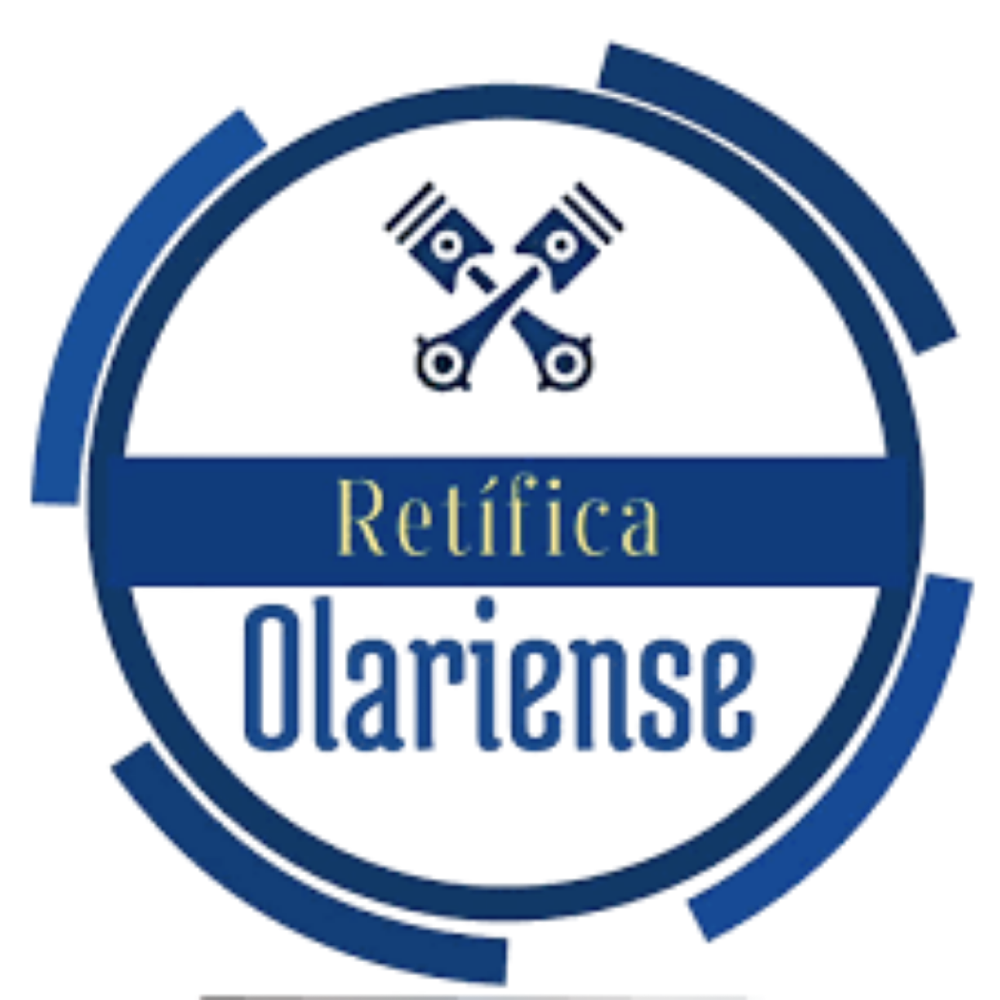
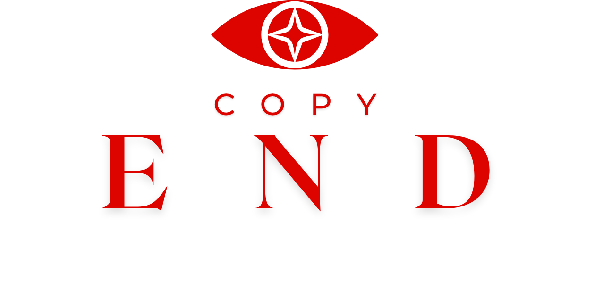

# Luiz Ferreira

Observador metódico de (eco)sistemas. Engenharia Mecatrônica e Ciências Ambientais. Atuo na convergência entre inteligência comercial, automação física, perícia técnica e arquitetura de produto. Cofundador da AODEV e responsável pela gestão comercial e inteligência de dados na Retífica Olariense. Desenvolvo sistemas orientados a eficiência operacional, telemetria industrial e comunicação estratégica de alta conversão. Utilizo Next.js, Node.js, JS Vanilla, CSS3, HTML5, SQL, Python, QGIS, Google Tag Manager e TouchDesigner para desenvolvimento web, geoprocessamento, análise de dados biogeoreferenciados, desenvolvimento de sistemas de gestão MVP's e infraestrutura para automação de processos, integrando sistemas via webhooks, APIs e funis de dados para conversão.

**Stack de Desenvolvimento** <br>
<p align="left">
  <a href="https://nextjs.org/" target="_blank"></a>
  <a href="https://nodejs.org/" target="_blank"></a>
  <a href="https://v8.dev/" target="_blank"></a>
  <a href="https://web.dev/learn/css/" target="_blank"></a>
  <a href="https://web.dev/learn/html/" target="_blank"></a>
  <a href="https://www.postgresql.org/" target="_blank"></a>
  <a href="https://www.python.org/" target="_blank"></a>
</p>

**Plataformas & Infraestrutura** <br>
<p align="left">
  <a href="https://qgis.org/" target="_blank"></a>
  <a href="https://marketingplatform.google.com/about/tag-manager/" target="_blank"></a>
  <a href="https://derivative.ca/" target="_blank"></a>
</p>

---

### Ecossistema de Projetos

| Projeto | Domínio | Descrição | Repositório |
| :--- | :--- | :--- | :--- |
| **RetificaPro** | SaaS / Mecânica e Usinagem | Plataforma de gestão e instrução técnica para oficinas mecânicas e retíficas de precisão. | `🔒 Privado` |
| **AODEV Nexus** | Software / Automação | Infraestrutura educacional de integrações via webhooks, APIs e funis de dados para conversão. | `🔒 Privado` |
| **Copyend** | Ensaios / Estratégia | Arquitetura de conteúdo, UX Writing, e SEO técnico. Síntese analítica, política e fundamentalista. | `🔒 Privado` |
| **DocApp Compliance** | Integrador ERP / QMS | Sistema integrador de documentações técnicas, ISOs, POPs e laudos periciais. | `🔒 Privado` |
---

---

### Matriz de Atuação Interdisciplinar

```text
Mecatrônica & Perícia         [███████████████████] 25%
C.R.O & Automações            [██████████████░░░░░] 20%            
Jornada de Vendas             [██████████████░░░░░] 20%          
Documentação / ISO's / ABNTs  [██████████░░░░░░░░░] 15%        
Licenciamentos / Licitações   [██████████░░░░░░░░░] 15%        
```

### Contato Executivo

<a href="https://wa.me/5521997187279?text=Ol%C3%A1%2C%20vim%20do%20github!" target="_blank"></a>
<a href="https://www.linkedin.com/in/copyend-luiz-ferreira" target="_blank"></a>

**E-mails (Por assunto):**
- <a href="mailto:contactluizferreira@gmail.com?subject=Contato%20via%20GitHub&body=Ol%C3%A1%2C%20vim%20do%20github!" target="_blank"></a> **Executivo / Pessoal**
- <a href="mailto:luizferreira@aodev.solutions?subject=Contato%20via%20GitHub&body=Ol%C3%A1%2C%20vim%20do%20github!" target="_blank"></a> **Comercial AODEV Solutions**
- <a href="mailto:luizferreira@retificaolariense.com.br?subject=Contato%20via%20GitHub&body=Ol%C3%A1%2C%20vim%20do%20github!" target="_blank"></a> **Comercial Retífica Olariense**

**Projetos & Corporativo:**
<p align="left" dir="auto">
  <a href="https://aodev.solutions/?utm_source=github" target="_blank">
    
  </a>
  <a href="https://retificaolariense.com.br/?utm_source=github" target="_blank">
    
  </a>
  <a href="https://copyend.vercel.app/?utm_source=github" target="_blank">
    
  </a>
  <a href="https://medium.com/@copyend" target="_blank">
    
  </a>
</p>
